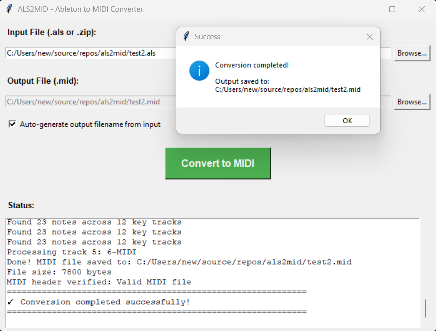

# ALS2MID

Ableton Project File to MIDI exporter

**Current Version: v1.0.6** | [Download Releases](https://github.com/twobob/als2mid/releases)

Converts Ableton Live project files (.als) and zipped projects to standard MIDI files, preserving notes, automation (pitch bend, modulation, filter cutoff), and multi-track structure. Now with powerful batch conversion mode!



## Download

**Windows Executables (No Python Required):**
- [als2mid-console.exe](https://github.com/twobob/als2mid/releases/latest) - Command-line version with batch mode
- [als2mid-gui.exe](https://github.com/twobob/als2mid/releases/latest) - GUI version with single/multi-file modes

**Or use Python source (cross-platform):**

## Features

- Extract MIDI from .als files (both plain and gzipped formats)
- **Supports Ableton Live 11 and 12** (including new TakeLanes structure in v12)
- Support for zipped Ableton projects
- Preserves multi-track structure
- **Preserves clip timing from arranger timeline** - clips retain their original position
- **Automatic multi-file output for large projects** - splits into multiple MIDI files when exceeding 16 tracks (MIDI channel limit)
- **Batch conversion mode** - process entire folders of .als files at once
- **Recursive folder search** - find and convert projects in subdirectories
- **Comprehensive logging** - individual and master summary logs for batch operations
- **Smart categorisation** - tracks successful, failed, and no-MIDI conversions separately
- Exports notes with velocity and duration
- Handles automation data (pitch bend, modulation, cutoff, device-specific parameters)
- Processes both session clips and arranger timeline clips
- Cross-platform (Windows, macOS, Linux)

## Requirements

- Python 3.x
- No external dependencies (includes bundled midiutil library)

## Installation

### Option 1: Download Pre-built Executables (Windows)
Download from [Releases](https://github.com/twobob/als2mid/releases/latest) - no installation needed!

### Option 2: Use Python Source (All Platforms)
```bash
git clone https://github.com/twobob/als2mid.git
cd als2mid
```

## Usage

### Windows Executable Usage

**GUI Version:**
- Double-click `als2mid-gui.exe`
- Select **Mode** from menu: Single File or Multi File
- **Single File Mode:**
  - Browse for your .als or .zip file
  - Choose output location (or use auto-generated name)
  - Click "Convert to MIDI"
- **Multi File Mode:**
  - Browse for folder containing .als files
  - Optional: Enable "Search sub-directories"
  - Optional: Enable "Output Logs" for per-file .export.log files
  - Click "Convert All Files"
  - Review summary with success/failed/no-MIDI counts
  - Check ALS2MID.export.log in folder for detailed results

**Console Version:**

Single file:
```cmd
als2mid-console.exe myproject.als
als2mid-console.exe myproject.als -o output.mid
```

Batch mode:
```cmd
als2mid-console.exe C:\path\to\folder --batch
als2mid-console.exe C:\path\to\folder --batch --recursive
als2mid-console.exe C:\path\to\folder --batch --logs
```

### Python Script Usage

#### GUI (Optional)

For a graphical interface with single and multi-file modes:
```bash
python als2mid_ui.py
```

The GUI provides:
- Mode toggle (Single File / Multi File)
- File/folder browser
- Output filename configuration (single mode)
- Batch options: recursive search, individual logs (multi mode)
- Real-time status log
- Summary statistics for batch operations

### Command Line (Main Script)

**Single File Mode:**

Convert an Ableton project file (creates `myproject.mid` in same directory):
```bash
python al2mid.py myproject.als
```

Convert a zipped Ableton project:
```bash
python al2mid.py myproject.zip
```

Specify output file:
```bash
python al2mid.py myproject.als -o output.mid
python al2mid.py myproject.als --output custom_name.mid
```

**Batch Mode:**

Convert all .als files in a folder:
```bash
python al2mid.py /path/to/folder --batch
```

Recursively search subdirectories:
```bash
python al2mid.py /path/to/folder --batch --recursive
```

Create individual log files for each conversion:
```bash
python al2mid.py /path/to/folder --batch --logs
```

### Command Line Arguments

**Single File Mode:**
- `input` - Input file (.als or .zip) **[required]**
- `-o`, `--output` - Output MIDI file path (optional, defaults to input filename with .mid extension)

**Batch Mode:**
- `input` - Folder path containing .als files **[required]**
- `--batch` - Enable batch processing mode
- `--recursive` - Search subdirectories for .als files
- `--logs` - Create individual .export.log file for each conversion

## Examples

**Single File:**
```bash
# Convert .als file (output: myproject.mid)
python al2mid.py myproject.als

# Convert zipped project with custom output name
python al2mid.py myproject.zip -o final_mix.mid

# Convert gzipped .als file
python al2mid.py gadget_project.als
```

**Batch Processing:**
```bash
# Convert all .als files in current folder
python al2mid.py . --batch

# Convert all .als files recursively
python al2mid.py /path/to/projects --batch --recursive

# With individual logs for each file
python al2mid.py /path/to/projects --batch --recursive --logs
```

## Batch Mode Output

When using batch mode, you'll get:
- **Console/GUI summary** showing counts for successful, failed, and no-MIDI conversions
- **Master log file** (`ALS2MID.export.log`) in the folder root with:
  - Complete list of processed files
  - Categorised results (successful, failed, no-MIDI)
  - Specific filenames for failures and no-MIDI projects
- **Individual logs** (optional, with `--logs` flag): `<filename>.export.log` for each conversion

## Test Files

Sample Ableton project files are included in the `testfiles/` folder for testing the converter.

## How It Works

1. Extracts XML from .als file (handles gzip, plain XML, and ZIP archives)
2. Parses MIDI tracks, clips, notes, and automation
3. Converts to standard MIDI format (Type 1 multi-track)
4. Outputs .mid file ready for use in any DAW
5. In batch mode: processes all files, tracks results, generates summary logs

## Supported Automation

### Standard MIDI Controllers
- **Pitch Bend** (ID 16200)
- **Modulation Wheel** (ID 16203, CC 1)
- **Filter Cutoff** (ID 16111, CC 74)
- **Filter Resonance** (ID 16112, CC 71)
- **Volume** (ID 16207, CC 7)
- **Pan** (ID 16208, CC 10)
- **Expression** (ID 16209, CC 11)
- **Sustain Pedal** (ID 16204, CC 64)
- **Reverb Send** (ID 16205, CC 91)
- **Chorus Send** (ID 16206, CC 93)

### Device-Specific Parameters (v1.0.5+)
Device-specific automation (VST/plugin parameters) is automatically mapped to unused MIDI CC numbers:
- **Safe unused CCs**: 85-87, 89-90, 102-119
- Each unique device parameter gets a consistent CC assignment
- Automation data is preserved but will need manual remapping in your target DAW
- Example: Simpler filter envelope → CC 85, Operator LFO rate → CC 86, etc.

## Files

- `al2mid.py` - Main converter script (cross-platform, command-line, batch mode)
- `als2mid_ui.py` - GUI wrapper with single/multi-file modes (requires tkinter)
- `midiutil_v1_2_1.py` - Bundled MIDI utility library
- `testfiles/` - Sample Ableton project files for testing

## Credits

- Original script by MrBlaschke
- Usability enhancements by rs2000
- Console/tkGUI X-platform support, Multi-track, Multi-CC, V11, V12, Batch mode updates by twobob

## License

Open Source mangling by twobob
Check https://github.com/MarkCWirt/MIDIUtil/blob/develop/License.txt for upstream concerns

## Version History

**v1.0.6** - Multi-file batch conversion mode
- Added batch processing for folders of .als files
- Recursive subdirectory search option
- Individual and master summary logs
- Smart categorisation (successful/failed/no-MIDI)
- Console version feature parity with GUI

**v1.0.5** - Device-specific automation mapping
- Device parameters mapped to unused CCs (85-119)
- Expanded automation support

**v1.0.4** - Expanded automation support
**v1.0.3** - Multi-file output for >16 tracks
**v1.0.2** - Timeline position preservation
**v1.0.1** - Ableton 12 TakeLanes support
**v1.0.0** - Initial release

## Compatibility

Tested with Ableton Live 11 and 12
- **Ableton 11**: Full support for all clip structures
- **Ableton 12**: Full support including new TakeLanes architecture
